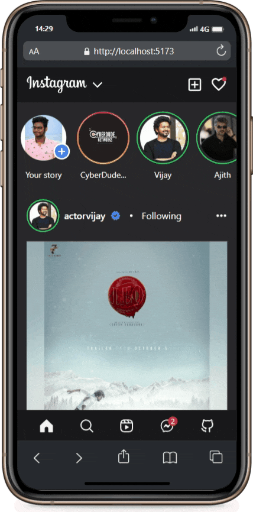

# Instagram UI using Tailwind CSS

## Table of Contents

- [Project Title](#project-title)
- [Description](#description)
- [Demo](#demo)
- [Internship](#internship)
- [Technologies Used](#technologies-used)
- [Installation](#installation)
- [License](#license)

## Description

I buid a UI clone of Instagram mobile app using HTML and Tailwind CSS

## Demo

[Live Preview ](https://sharif-22.github.io/Instagram-UI-Tailwind/)



## Internship

This internship is provided by [CyberDude Networks Pvt. Ltd.](https://youtube.com/cyberdudenetworks) as part of the 6-Month Free Internship program, a skill development initiative organized to enhance participants' skills. Mentoring was provided by [Mr. Anbuselvan Rocky](https://instagram.com/anbuselvanrocky). For more information, [you can contact CyberDude Networks here](https://cyberdudenetworks.com).

## Technologies Used

<ol>
    <li>HTML</li>
    <li>Tailwind CSS</li>
    <li>Vite </li>
</ol>

## Installation

<h3>Clone the Repository:</h3>

```

git clone https://github.com/sharif-22/Instagram-UI-Tailwind

```

Navigate to the project

```

cd Instagram-UI-Tailwind

```

Install the Dependencies

```

npm install

```

Run the Project

```

npm run dev

```

## License

[MIT](./LICENCE.md)

```

```
